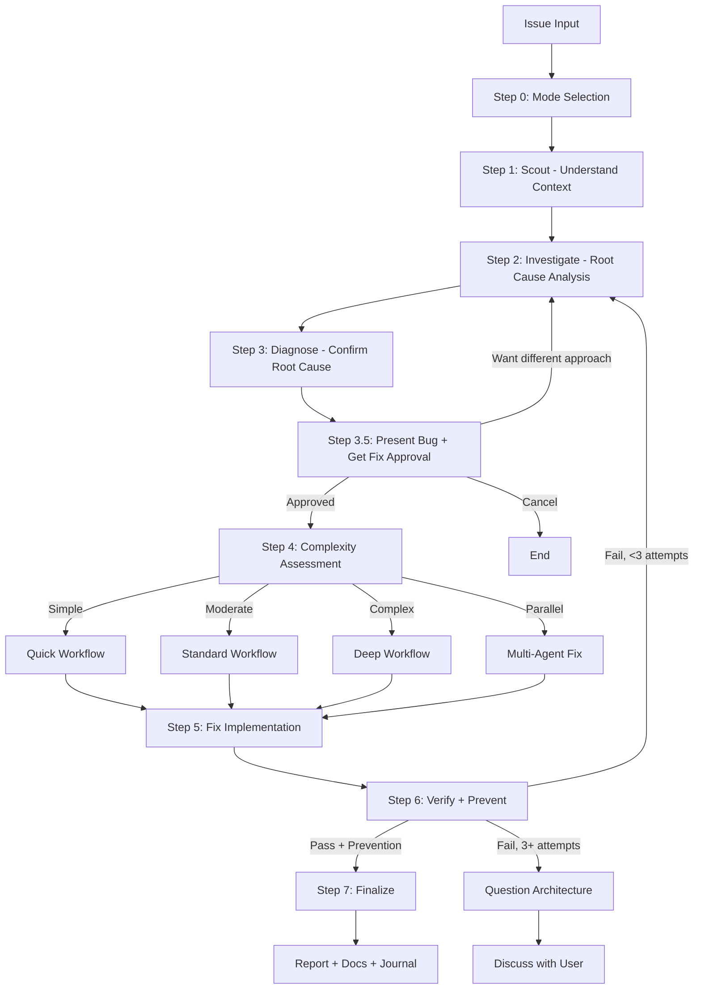

# Debug + Fix (Unified)

**Single skill** combining systematic debugging (`ck:debug`) + structured fix workflow (`ck:fix`) into one cohesive flow. Replaces 2 separate ClaudeKit skills.

## Core Principle

**NO FIXES WITHOUT ROOT CAUSE INVESTIGATION FIRST**

Random fixes waste time and create new bugs. Always: investigate → diagnose → fix at source → validate at every layer → verify with fresh evidence.

## When to Use

**Code-level:** Test failures, bugs, unexpected behavior, build failures, integration problems, type errors, lint issues
**System-level:** Server errors, CI/CD pipeline failures, performance degradation, database issues, log analysis
**Always:** Before claiming work complete

## Arguments

- `--auto` - Autonomous mode (**default**), auto-approve if score >= 9.5 & 0 critical
- `--review` - Human-in-the-loop review mode, pause for approval at each step
- `--quick` - Quick mode for trivial issues (lint, type errors), fast cycle
- `--parallel` - Parallel mode: route to parallel `fullstack-developer` agents per issue

<HARD-GATE>
Do NOT propose or implement fixes before completing Steps 1-2 (Scout + Diagnose).
Symptom fixes are failure. Find root cause first through structured analysis, NEVER guessing.
If 3+ fix attempts fail, STOP and question architecture — discuss with user.
User override: `--quick` mode allows fast scout→diagnose→fix cycle for trivial issues.
</HARD-GATE>

## Anti-Rationalization

| Thought | Reality |
|---------|---------|
| "I can see the problem, let me fix it" | Seeing symptoms ≠ understanding root cause. Scout first. |
| "Quick fix for now, investigate later" | "Later" never comes. Fix properly now. |
| "Just try changing X" | Random fixes waste time and create new bugs. Diagnose first. |
| "It's probably X" | "Probably" = guessing. Use structured diagnosis. Verify first. |
| "One more fix attempt" (after 2+) | 3+ failures = wrong approach. Question architecture. |
| "Tests pass, we're done" | Without prevention, same bug class will recur. Add guards. |
| "Should work now" / "Seems fixed" | Without verification evidence, you don't know. Run command. Read output. |

## Process Flow (Authoritative)



## Workflow

### Step 0: Mode Selection

**First action:** If no `--auto` flag, use `AskUserQuestion` to determine workflow mode:

| Option | Recommend When | Behavior |
|--------|----------------|----------|
| **Autonomous** (default) | Simple/moderate issues | Auto-approve if score >= 9.5 & 0 critical |
| **Human-in-the-loop Review** | Critical/production code | Pause for approval at each step |
| **Quick** | Type errors, lint, trivial bugs | Fast scout → diagnose → fix → review cycle |

See `references/mode-selection.md`.

### Step 1: Scout (MANDATORY)

**Purpose:** Understand affected codebase BEFORE forming hypotheses.

**Mandatory:**
1. Activate `sk:scout` skill OR launch 2-3 parallel `Explore` subagents
2. Discover: affected files, dependencies, related tests, recent changes (`git log`)
3. Read `./docs` for project context if unfamiliar

**Quick mode:** Minimal — locate affected file(s) + direct dependencies only
**Standard/Deep:** Full — module boundaries, test coverage, call chains

**Output:** `✓ Step 1: Scouted - [N] files mapped, [M] dependencies, [K] tests found`

### Step 2: Investigate (Root Cause Investigation)

**Purpose:** Trace bugs backward through call stack to find original trigger.

**Techniques (load as needed):**
1. **Systematic Debugging** (`references/systematic-debugging.md`) - Four-phase framework: Root Cause Investigation → Pattern Analysis → Hypothesis Testing → Implementation
2. **Root Cause Tracing** (`references/root-cause-tracing.md`) - Trace backward through call stack. Use `scripts/find-polluter.sh` for test pollution
3. **Investigation Methodology** (`references/investigation-methodology.md`) - 5-step structured investigation for system-level
4. **Log & CI/CD Analysis** (`references/log-and-ci-analysis.md`) - `gh` CLI, structured log queries
5. **Performance Diagnostics** (`references/performance-diagnostics.md`) - Query analysis, latency, resource utilization

**Key insight:** Fix at SOURCE, not symptom.

### Step 3: Diagnose (MANDATORY)

**Purpose:** Structured root cause analysis with evidence. NO guessing.

**Mandatory chain:**
1. **Capture pre-fix state:** Record exact errors, failing test output, stack traces, log snippets. This is baseline for Step 6 verification.
2. Activate `sk:sequential-thinking` skill — structured reasoning, NOT guessing
3. Spawn parallel `Explore` subagents to test hypotheses against codebase
4. If 2+ hypotheses fail → auto-activate `sk:problem-solving` skill
5. Create diagnosis report: confirmed root cause, evidence chain, affected scope

See `references/diagnosis-protocol.md`.

**Output:** `✓ Step 3: Diagnosed - Root cause: [summary], Evidence: [brief], Scope: [N files]`

### Step 3.5: Present Bug Report + Get Fix Approval (MANDATORY)

**Purpose:** Trình bày rõ bug + đề xuất hướng fix → user xác nhận trước khi đụng code.

**Skip condition:** Chỉ skip nếu user pass `--auto` flag VÀ confidence score >= 9.5 VÀ 0 critical issues.

#### A. Bug Report (output to user)

Format trình bày rõ ràng:

```markdown
## 🐛 Bug Report

### Triệu chứng (Symptoms)
- [Mô tả ngắn gọn cái user thấy]
- Error message: `<exact error>`
- File/line: `path/to/file.ts:42`

### Root Cause (Nguyên nhân gốc)
- [1-2 câu giải thích TẠI SAO bug xảy ra]
- Evidence: [file, line, code snippet chứng minh]

### Impact (Phạm vi ảnh hưởng)
- Files affected: [list]
- Severity: Low / Medium / High / Critical
- Bug class: [Security / Logic / Performance / Type / Race condition / etc.]

### Why it happened (root cause analysis)
- [Mechanism: race condition? null check missing? wrong assumption?]
```

#### B. Fix Approach Proposal

Đề xuất 2-3 hướng fix khả thi qua `AskUserQuestion`:

```javascript
AskUserQuestion({
  questions: [{
    question: "Em đã tìm ra root cause. Anh muốn fix theo hướng nào?",
    header: "Fix Approach",
    options: [
      {
        label: "Approach 1: <recommended> (Recommended)",
        description: "Quick description + tradeoff. Vd: 'Add null check at API boundary - safe, minimal change, ~3 lines'"
      },
      {
        label: "Approach 2: <alternative>",
        description: "Alternative tradeoff. Vd: 'Refactor type system - more thorough, ~30 lines, affects 5 files'"
      },
      {
        label: "Approach 3: <conservative>",
        description: "Conservative option. Vd: 'Defensive validation at all layers - safest, ~10 lines'"
      }
    ]
  }]
})
```

#### C. Confirmation Question

Sau khi user chọn approach:

```javascript
AskUserQuestion({
  questions: [{
    question: "Xác nhận: tiếp tục fix với approach đã chọn?",
    header: "Confirm Fix",
    options: [
      { label: "Yes, proceed with fix", description: "Bắt đầu Step 4-7" },
      { label: "Show me the proposed code first", description: "Em viết code preview, anh review trước khi apply" },
      { label: "Let me investigate more", description: "Quay lại Step 2" },
      { label: "Cancel", description: "Dừng workflow" }
    ]
  }]
})
```

#### D. When to Skip

Auto-skip Step 3.5 (đi thẳng qua Step 4) khi:
- User pass `--auto` AND confidence >= 9.5 AND 0 critical
- Trivial fix detected (lint, type cast, format)
- User pass `--no-confirm` flag explicitly

#### E. Anti-patterns

❌ **KHÔNG được làm:**
- Tự động fix mà không trình bày bug
- Hỏi vague: "Có muốn fix không?" (phải có 2-3 approach options cụ thể)
- Bỏ qua bug report (user phải biết bug GÌ + TẠI SAO)

✅ **PHẢI làm:**
- Bug report đầy đủ 4 sections (Symptoms, Root Cause, Impact, Why)
- 2-3 approach options với pros/cons rõ ràng
- Confirmation trước khi đụng code

**Output:** `✓ Step 3.5: User approved approach: [approach name]`

### Step 4: Complexity Assessment & Task Orchestration

Classify before routing. See `references/complexity-assessment.md`.

| Level | Indicators | Workflow |
|-------|------------|----------|
| **Simple** | Single file, clear error, type/lint | `references/workflow-quick.md` |
| **Moderate** | Multi-file, root cause unclear | `references/workflow-standard.md` |
| **Complex** | System-wide, architecture impact | `references/workflow-deep.md` |
| **Parallel** | 2+ independent issues OR `--parallel` | Parallel `fullstack-developer` agents |

**Task Orchestration (Moderate+ only):** Create native Claude Tasks with dependencies. See `references/task-orchestration.md`.
- Skip for Quick workflow (overhead exceeds benefit)
- Use `TaskCreate` with `addBlockedBy` for chains
- Update via `TaskUpdate` as phases complete
- **Fallback:** If Task tools unavailable (VSCode), use `TodoWrite`. Workflow remains functional.

### Step 5: Fix Implementation

- Implement per selected workflow, updating Tasks as phases complete
- Follow diagnosis findings — fix ROOT CAUSE, not symptoms
- Minimal changes only. Follow existing patterns
- **Defense-in-Depth** (`references/defense-in-depth.md`): Validate at every layer (Entry → Business logic → Environment guards → Debug instrumentation)

### Step 6: Verify + Prevent (MANDATORY)

**Purpose:** Prove fix works AND prevent same bug class from recurring.

**Iron law:** NO COMPLETION CLAIMS WITHOUT FRESH VERIFICATION EVIDENCE.

**Mandatory:**
1. **Verify:** Run EXACT commands from pre-fix state capture. Compare output.
2. **Regression test:** Add test that FAILS without fix and PASSES with fix
3. **Prevention gate:** Apply defense-in-depth where applicable. See `references/prevention-gate.md`
4. **Parallel verification:** Launch `Bash` agents for typecheck + lint + build + test
5. **Frontend verification** (`references/frontend-verification.md`): If frontend (tsx/jsx/vue/svelte/html/css), screenshot via Chrome MCP + console error check

**If verification fails:** Loop to Step 3 (re-diagnose). After 3 failures → question architecture, discuss with user.

**Output:** `✓ Step 6: Verified + Prevented - [before/after], [N] tests added, [M] guards added`

### Step 7: Finalize (MANDATORY)

1. **Report summary:** confidence score, root cause, changes, files, prevention
2. **`docs-manager` subagent** → update `./docs` if changes warrant
3. **`TaskUpdate`** → mark ALL Tasks `completed` (skip if unavailable)
4. **Ask user:** want to commit via `git-manager` subagent?
5. **`/sk:journal`** → write concise technical journal entry

---

## Quick Reference

```
Code bug          → Step 2: systematic-debugging.md (Phase 1-4)
  Deep in stack   → root-cause-tracing.md (trace backward)
  Found cause     → defense-in-depth.md (add layers)
  Claiming done   → verification.md (verify first)

System issue      → investigation-methodology.md (5 steps)
  CI/CD failure   → log-and-ci-analysis.md
  Slow system     → performance-diagnostics.md
  Need report     → reporting-standards.md

Frontend fix      → frontend-verification.md (Chrome/devtools)
```

## Skill Activation Matrix

**Always activate:**
- `sk:scout` (Step 1) — understand before diagnosing
- `sk:sequential-thinking` (Step 3) — structured hypothesis formation

**Conditional:**
- `sk:problem-solving` — auto-triggers when 2+ hypotheses fail
- `sk:brainstorm` — multiple valid approaches, architecture decision (Deep only)
- `sk:context-engineering` — fixing AI/LLM/agent code
- `sk:project-management` — moderate+ for task hydration

**Subagents:** `debugger`, `researcher`, `planner`, `code-reviewer`, `tester`, `Bash`
**Parallel:** Multiple `Explore` agents for scouting, `Bash` agents for verification

## Tools Integration

- **Database:** `psql` for PostgreSQL queries and diagnostics
- **CI/CD:** `gh` CLI for GitHub Actions logs
- **Codebase:** `sk:docs-seeker` for package docs; `sk:repomix` for codebase summary
- **Scouting:** `/sk:scout` for finding files
- **Frontend:** Chrome browser or `sk:chrome-devtools` skill for visual verification

## Output Format

```
✓ Step 0: [Mode] selected
✓ Step 1: Scouted - [N] files, [M] deps
✓ Step 2: Investigated - [techniques applied]
✓ Step 3: Diagnosed - Root cause: [summary]
✓ Step 3.5: User approved approach: [approach name]
✓ Step 4: [Complexity] detected - [workflow] selected
✓ Step 5: Fixed - [N] files changed
✓ Step 6: Verified + Prevented - [tests added], [guards added]
✓ Step 7: Complete - [action taken]
```

## Example Run (Step 3.5 in action)

```
User: /sk:debug-fix "Login form crashes when email is empty"

[After Step 1-3 done...]

🐛 Bug Report
─────────────────────────────────────
Triệu chứng:
- TypeError: Cannot read properties of undefined (reading 'toLowerCase')
- File: src/auth/validate.ts:18
- Trigger: User submit form with empty email field

Root Cause:
- validateEmail() không null-check trước khi gọi .toLowerCase()
- Form không sanitize input - cho phép undefined pass through

Impact:
- Files: src/auth/validate.ts, src/components/LoginForm.tsx
- Severity: HIGH (production crash)
- Bug class: Null safety / Defensive programming

Why it happened:
- Original dev assumed React Hook Form sẽ default to empty string
- Nhưng <input> không có defaultValue → undefined initially

═══════════════════════════════════════
┌──────────────────────────────────────┐
│ Em đã tìm ra root cause.            │
│ Anh muốn fix theo hướng nào?         │
├──────────────────────────────────────┤
│ [1] Add null check at API boundary  │
│     (Recommended) ← 3 lines, safe   │
│ [2] Refactor with TypeScript strict │
│     30 lines, affects 5 files       │
│ [3] Defensive validation all layers │
│     10 lines, safest, more verbose  │
└──────────────────────────────────────┘
   ↑↓ navigate · Enter select

User chọn [1]

┌──────────────────────────────────────┐
│ Xác nhận: tiếp tục fix?             │
├──────────────────────────────────────┤
│ [1] Yes, proceed with fix            │
│ [2] Show me the proposed code first │
│ [3] Let me investigate more          │
│ [4] Cancel                           │
└──────────────────────────────────────┘

User chọn [1] → Step 4 starts
```

## Red Flags

Stop and follow process if thinking:
- "Quick fix for now, investigate later"
- "Just try changing X and see if it works"
- "It's probably X, let me fix that"
- "Should work now" / "Seems fixed"
- "Tests pass, we're done"
- "Emergency, no time for process"

**All mean:** Return to systematic process.

## References

Load as needed:

**Investigation:**
- `references/systematic-debugging.md` - 4-phase framework
- `references/root-cause-tracing.md` - Backward trace through call stack
- `references/investigation-methodology.md` - 5-step system-level
- `references/log-and-ci-analysis.md` - Logs + CI/CD debugging
- `references/performance-diagnostics.md` - Performance bottlenecks
- `references/reporting-standards.md` - Diagnostic reports

**Workflow:**
- `references/mode-selection.md` - AskUserQuestion for mode
- `references/diagnosis-protocol.md` - Structured diagnosis methodology
- `references/complexity-assessment.md` - Classification criteria
- `references/task-orchestration.md` - Native Claude Task patterns
- `references/workflow-quick.md` - Quick cycle
- `references/workflow-standard.md` - Standard with Tasks
- `references/workflow-deep.md` - Deep: research + brainstorm + plan
- `references/review-cycle.md` - Autonomous vs HITL
- `references/skill-activation-matrix.md` - When to activate skills
- `references/parallel-exploration.md` - Parallel coordination

**Verification:**
- `references/verification.md` - Iron-law verification
- `references/defense-in-depth.md` - Layer validation
- `references/prevention-gate.md` - Prevention requirements
- `references/frontend-verification.md` - Chrome MCP verification

**Specialized:**
- `references/workflow-ci.md` - GitHub Actions/CI
- `references/workflow-logs.md` - Application logs
- `references/workflow-test.md` - Test suite failures
- `references/workflow-types.md` - TypeScript errors
- `references/workflow-ui.md` - Visual/UI issues
- `references/task-management-debugging.md` - Multi-step investigations
- `references/frontend-verification.md` - Chrome MCP + visual verification

## Scripts

- `scripts/find-polluter.sh` - Bisect test pollution

---

## Migration from sk:debug + sk:fix

**Old workflow (2 skills):**
```
/sk:debug "API returns 500" → investigate
   ↓
/sk:fix → implement fix
```

**New workflow (1 skill):**
```
/sk:debug-fix "API returns 500" → investigate + fix in one go
```

**Backwards compat:** `/sk:debug` and `/sk:fix` deprecated — both route to `/sk:debug-fix`. Use new command going forward.

---

## LLM Mismatch Warning (MANDATORY)

When fixing a phase from `/sk:plan`, MUST check if current LLM matches phase's `suggested_llm`.

### Workflow

1. Read related phase file frontmatter (if any)
2. Extract `suggested_llm` field
3. Compare with current runtime LLM
4. If mismatch → AskUserQuestion warning

### Warning Pattern

```javascript
AskUserQuestion({
  questions: [{
    question: "⚠️ Phase này được suggest dùng GPT, đang debug+fix với Claude. Tiếp tục?",
    header: "LLM Mismatch",
    options: [
      { label: "Yes, tiếp tục với Claude (Recommended)", description: "Claude xử lý debug tốt" },
      { label: "Skip warning", description: "Không hỏi nữa session này" }
    ]
  }]
})
```

### Notes

- Bug fixing thường complex → Claude is preferred default
- Even if phase says GPT, fix tasks often warrant Claude (root-cause analysis)
- This warning is informational only

---

## User Interaction (MANDATORY)

This skill MUST follow [Interactive UI Protocol](../../rules/interactive-ui-protocol.md).

**Rules:**
- Use `AskUserQuestion` tool for ALL user clarifications/choices
- Never ask via free-text prompts like "Please answer: 1) X? 2) Y?"
- Each question: 2-4 predefined options + auto "Something else"
- Exception: genuine free-form inputs (file paths, custom names, code snippets)

See rule for full specification.
